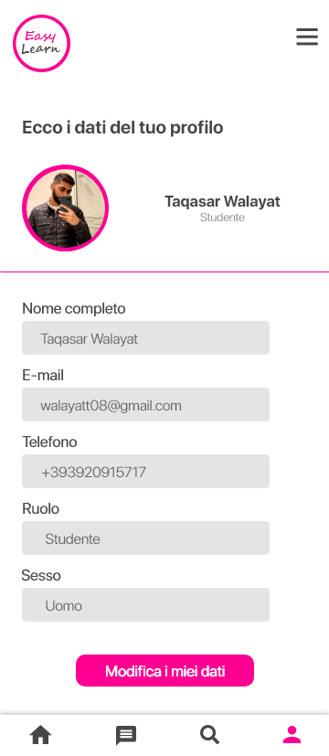

# Easy Learn 📱
This is a small **Android OS based App** project, developed for the **Object Oriented Programming (OOP)** course of my **BSc Computer Engineering major**.
The aim of this app is to give a first easy and sweet approach to the **Computer Science World to complete beginners**. Users can read up to date **guides about the latest technology** and also test their knowledge throughout **multiple choice quizzes**.
\
\
\
**Authors** 👨‍💻
* [Taqasar Walayat](https://www.instagram.com/taqasar/)
* [Matteo Alfonzi](https://www.instagram.com/matteoalfonzi/)
\
\
❌ Note thay Easy Learn is **not** available to download in online marketplaces because it is an academic project.
\
\
*Preview* 📸
\
\

\
\
\
***Please let us know if you use, copy, duplicate, replicate or distribute partially or entirely code sources, images or any file related to this repository***
